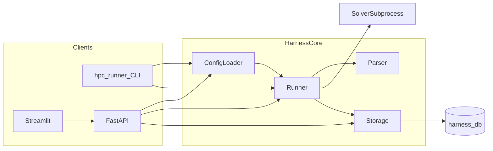

# HPC Regression Platform — MVP

Modular, execution-agnostic HPC regression testing system for the Dow/Berkeley Capstone (Spring 2026).

Notable changes by release period: [CHANGELOG.md](CHANGELOG.md).

**Full architecture (diagrams, sequences, API reference):** [docs/architecture.md](docs/architecture.md)

## Project overview

The platform is a **solver-first** harness: you maintain **resources**, **systems**, and **solver packages** under YAML on disk. There is **no** `configs/jobs/` tree—runnables are expanded at load and run time from each solver’s `allowed_systems` and `default_system`. The harness names each run **`{solver}@{system}`** for display, storage, and APIs. Solver entrypoints run as **black-box subprocesses**; they may call SLURM, MPI, or Docker internally—the core harness does not embed schedulers.



**Key components:** **Runner** (orchestrates subprocess execution), **Parser** (YAML-driven metric extraction), **Storage** (SQLite `harness.db`), **REST API** (FastAPI), **Streamlit UI** (dashboard), **YAML config** (`configs/resources`, `configs/systems`, `configs/solvers`).

## Repository directory map

```
.
├── configs/                 # Declarative YAML: resources, systems, solver packages (no jobs/ subtree)
├── data/                    # Default SQLite database (harness.db); gitignored
├── docker/                  # Compose for API/UI, LAMMPS/SLURM smoke assets (see docker/README.md)
├── docs/                    # Architecture, user guide, E2E and SLURM guides
├── scripts/                 # Helpers invoked from the Makefile (services, Docker validation)
├── src/
│   ├── core/                # harness package: CLI, config loader/schemas, runner, parser, storage
│   │   ├── src/harness/     # Library code
│   │   └── tests/           # Core unit tests
│   ├── api/                 # basic_restapi: FastAPI app and invocations
│   │   ├── src/basic_restapi/
│   │   └── tests/           # API tests
│   └── ui/                  # Streamlit app
│       ├── app.py           # Entry
│       └── tests/e2e/       # Playwright E2E tests
├── .github/workflows/       # CI workflows
├── Makefile                 # test, api, ui, docker, slurm targets
├── pyproject.toml           # uv workspace (harness, basic_restapi, UI)
└── CHANGELOG.md
```

## Naming conventions and style

- **Python:** [PEP 8](https://peps.python.org/pep-0008/) — `snake_case` for modules and functions, `PascalCase` for types where used. Lint with `make lint` (Ruff).
- **Python filenames:** `snake_case.py`.
- **Solver bundle directories:** under `configs/solvers/`, use **kebab-case** folder names (e.g. `echo-solver`, `lammps-slurm`) to match existing packages.
- **YAML keys:** align with [src/core/src/harness/config/schemas.py](src/core/src/harness/config/schemas.py).
- **Git branches:** e.g. `feature/…`, `bugfix/…`, `release/…`.
- **Commits (recommended):** [Conventional Commits](https://www.conventionalcommits.org/) for readable history.
- **Run identity:** `{solver}@{system}` everywhere in harness, API, and UI—not a separate on-disk “job” config; derived from solver-first expansion.
- **Metrics:** lowercase with underscores; optional `unit` and bounds in solver metric specs.

## Architectural overview (concise)

- **Solver-first YAML** — Only `resources/`, `systems/`, and `solvers/` under the config root; `load_all()` validates cross-references on load.
- **Runner** — Spawns solver entrypoints; captures stdout/stderr; integrates with optional background invocations and SLURM metadata when present.
- **Parser** — Regex and rules from per-solver `parser_config` YAML; metrics validated against solver `metrics` specs.
- **Storage** — SQLite stores runs, metrics JSON, batch and baseline fields.
- **API** — FastAPI exposes runs, invocations, metrics, baselines; Streamlit uses HTTP only (see [docs/architecture.md](docs/architecture.md) for sequences).

**Data flow:** CLI → Runner → Parser → Storage → API → UI (the UI reads and drives work through the REST API over HTTP).

**SLURM / LAMMPS:** Optional integration via solver scripts and environment; see the [SLURM + LAMMPS](#slurm--lammps) commands below and [docs/slurm_lammps_e2e.md](docs/slurm_lammps_e2e.md).

## Development workflow

```bash
# Dependencies
uv sync --all-extras --dev

# List solvers (loads and validates configs)
uv run hpc-runner configs --list

# Run all configured solvers (default config dir: configs)
uv run hpc-runner configs

# Run specific solvers
uv run hpc-runner configs --solver echo-solver

# Dry run without persisting to the database
uv run hpc-runner configs --no-store

# Scaffold a solver from a command (see CLI table for flags)
uv run hpc-runner --add 'echo hello' --system <system_name>
```

**Add a solver manually:** Create `configs/solvers/<name>/` with `solver.yaml`, a runnable entrypoint (`run.sh` or `run.py`), and optional `parser_config.yaml`. Copy patterns from [configs/solvers/_template/](configs/solvers/_template/) or an existing solver.

**Validate configs:** `uv run hpc-runner configs --list` runs the loader and `validate_config` (resources ↔ systems ↔ solvers). Run `make test` for automated coverage.

**Run services:** `make api` (port 8000, `/docs`), `make ui` (port 8501). Background helpers: `make start-services`, `make stop-services`, `make restart-services`.

## Testing and validation

| Layer | Command / location | Role |
|-------|-------------------|------|
| Unit (core) | `make test` or `uv run pytest src/core/tests -q` | Config, parser, storage, runner, CLI, add-solver |
| API | `make test-api` or `uv run pytest src/api/tests` | REST contracts; use `make test-slurm` for gated SLURM/LAMMPS |
| E2E (UI) | `make test-e2e` | Playwright against Streamlit ([docs/e2e_quickstart.md](docs/e2e_quickstart.md)); `make e2e` is an alias |
| E2E (Docker) | `make test-e2e-docker` | Streamlit + Playwright in Compose; `make e2e-docker` is an alias |
| E2E (UI in Docker, local Playwright) | `make test-e2e-docker-ui` | `make e2e-docker-ui` is an alias |
| Docker images | `make docker-validate` | Build + API health check |
| SLURM smoke | `make test-slurm` (sets `RUN_SLURM_E2E=1` and defaults `DOCKER_SLURM_CONTAINER` to `sci_slurm-gpu-worker-1`; override when needed, see [docs/slurm_lammps_e2e.md](docs/slurm_lammps_e2e.md)) | Integration with external Slurm stack |

**Manual smoke:** After `uv run hpc-runner configs --solver echo-solver`, expect a completed run with metrics stored when not using `--no-store`; confirm in the UI or `hpc-runner configs --list-runs`.

Core unit test modules:

| Test Module | Coverage |
|-------------|----------|
| `test_config.py` | Resource, System, Solver loading; template skip |
| `test_parser.py` | Metric extraction, validation |
| `test_storage.py` | DB init, store_run, queries, baselines, history |
| `test_runner.py` | End-to-end run, metric extraction from solver output |
| `test_add_solver.py` | `--add` solver creation and naming |

## Quick Start

```bash
# Sync dependencies
uv sync --all-extras --dev

# Run unit tests
make test

# List available solvers
uv run hpc-runner configs --list

# Run all solvers
uv run hpc-runner configs

# Run with custom config dir
uv run hpc-runner /path/to/configs --solvers-dir /path/to/configs/solvers

# Start REST API (programmatic access; root redirects to /docs)
make api
# Open http://localhost:8000 → interactive API docs at /docs

# Or start Streamlit dashboard (interactive UI)
make ui
# Open http://localhost:8501
```

Stop or restart API and UI (ports 8000 and 8501):

```bash
make stop-services    # Stop API and UI
make start-services   # Start API and UI in background (logs: .api.log, .ui.log)
make restart-services # Stop then start API and UI in background
```

### SLURM + LAMMPS

Loads `slurm-lammps.env` if present — copy from `slurm-lammps.env.example`:

```bash
make start-services-slurm
make restart-services-slurm
```

Inputs live under `docker/lammps/` (do not modify external `sci_slurm`). See [docs/slurm_lammps_e2e.md](docs/slurm_lammps_e2e.md). Start an external Slurm Docker stack: **`make slurm-up`** (set `SLURM_COMPOSE_DIR` if not using a `./sci_slurm` checkout). **`make test-slurm`** sets `RUN_SLURM_E2E=1` and defaults **`DOCKER_SLURM_CONTAINER=sci_slurm-gpu-worker-1`** for the pytest process (override if your Compose container name differs). Optional Compose overlay: `docker/docker-compose.slurm.yml` and [docker/README.md](docker/README.md).

## Docker

Build and run the REST API:

```bash
make docker-build
make docker-run
# Open http://localhost:8000 (redirects to /docs for interactive API)
```

Run tests in container:

```bash
make docker-test
```

Or with docker-compose:

```bash
make docker-up
# or: docker compose -f docker/docker-compose.yml up --build
```

Validate Docker images (build + API health check):

```bash
make docker-validate
```

## Configuration structure (solver-first)

```
configs/
├── resources/     # CPU/GPU, memory, node definitions
├── systems/       # Resource bundles, env vars
└── solvers/       # Solver packages (one directory per solver)
    └── my-solver/
        ├── solver.yaml           # Metadata, allowed_systems, default_system, parser_config, metrics
        ├── run.sh                # Or run.py — executed as black-box
        └── parser_config.yaml    # Optional: regex patterns for metrics

docker/
└── lammps/        # LAMMPS inputs for SLURM smoke (repo-owned)
    └── in.lammps
```

## CLI

| Command | Description |
|---------|-------------|
| `hpc-runner [config_dir]` | Run all solvers (config_dir defaults to `configs`) |
| `hpc-runner [config_dir] --list` | List available solvers |
| `hpc-runner [config_dir] --list-runs` | List recent runs from DB (last 20) |
| `hpc-runner [config_dir] --solver NAME` | Run specific solver(s); repeat `--solver` for multiple |
| `hpc-runner [config_dir] -v` | Verbose: print each run’s stdout/stderr (solver output) on stderr; JSON includes `stdout`/`stderr` |
| `hpc-runner [config_dir] --no-store` | Run without persisting to DB |
| `hpc-runner [config_dir] --db PATH` | Override database path |
| `hpc-runner [config_dir] --solvers-dir PATH` | Override solvers directory (default: `configs/solvers`) |
| `hpc-runner --add CMD --system NAME` | Create solver from command and run it |

## REST API

| Endpoint | Method | Description |
|----------|--------|-------------|
| `/` | GET | Redirects to `/docs` (Swagger UI) |
| `/api/health` | GET | Health check (returns `{"status": "ok"}`) |
| `/api/solvers` | GET | List configured solvers (includes `default_system`) |
| `/api/systems` | GET | List systems |
| `/api/run_solvers` | POST | Run solvers (`solvers`, `batch_name`, `background`; one invocation per solver when background; 202 + `invocations`) |
| `/api/runs` | GET | List recent runs (?solver=, ?processor=, ?limit=, ?offset=) |
| `/api/runs` | DELETE | Delete runs (body: `{"ids": [1,2,3]}`) |
| `/api/runs/<id>` | GET | Get run details |
| `/api/runs/<id>/slurm_status` | GET | Live SLURM queue state when `RUN_SLURM_E2E=1` |
| `/api/runs/<id>/set_baseline` | POST | Set a run as the baseline for its solver |
| `/api/invocations` | GET | List background invocations (`?active_only=true`) |
| `/api/invocations/<id>` | GET | Background run status, SLURM ids, batch progress / results, `execution` block |
| `/api/invocations/<id>/execution_status` | GET | Unified monitor payload + `scheduler_detail` when SLURM ids exist |
| `/api/invocations/<id>/slurm_status` | GET | Live SLURM state for ids on this invocation |
| `/api/invocations/<id>/cancel` | POST | Cancel background run |
| `/api/solver_summaries` | GET | Per-solver run aggregates |
| `/api/metrics/<solver>/<metric>` | GET | Metric history for trends |
| `/api/available_metrics` | GET | Solver/metric pairs |
| `/api/solvers/<solver>/baseline` | GET | Current baseline run for a solver |
| `/api/baseline_comparison` | GET | Compare runs to baseline (?solver=, ?limit=) |
| `/api/get_job_batch_uuids` | GET | Batch UUIDs (ordered by latest activity per batch) |

## Design principles

- **Execution-Agnostic** — Solver scripts control execution (SLURM, MPI, `docker exec`, etc.); harness code does not embed scheduler APIs
- **Modular** — Resources, systems, and solvers defined independently
- **Pluggable** — Add solvers by dropping a folder with `solver.yaml` + run script
- **Solver-first** — No separate jobs config layer; runnables derive from solver YAML and systems
