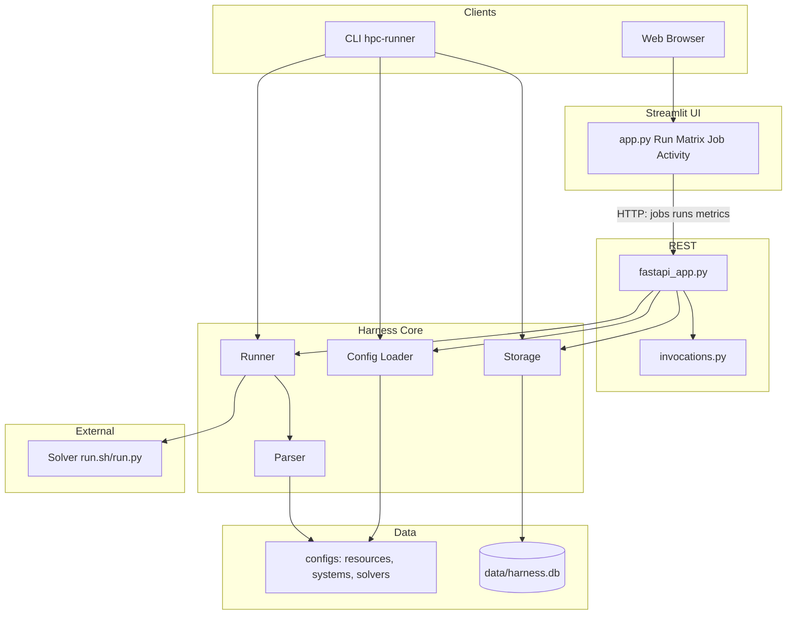
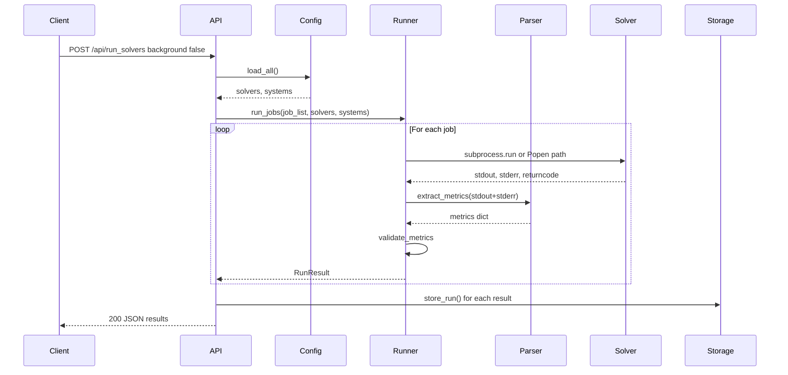
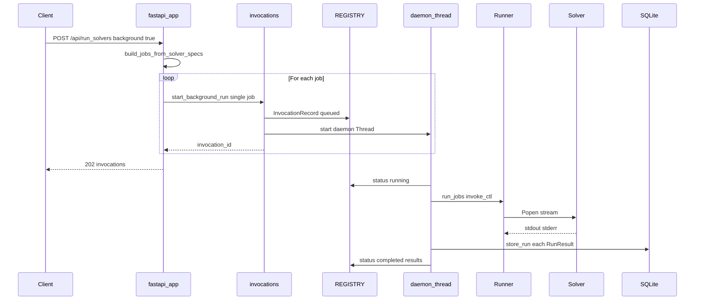
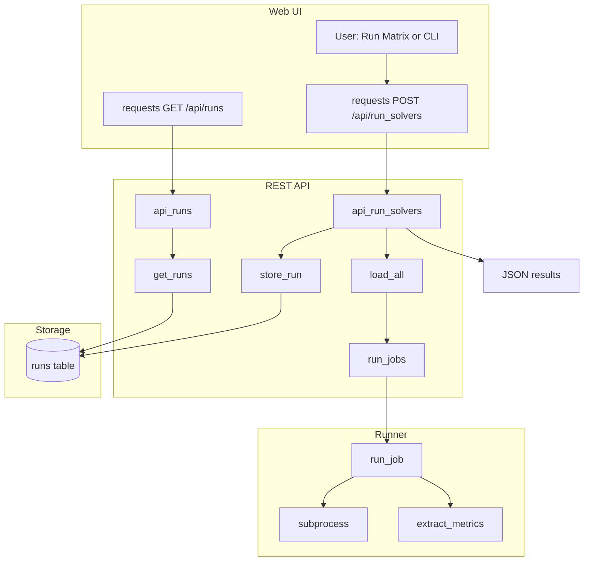

# System Architecture

Style guide, repository directory map, and sponsor-facing overview: [README.md](../README.md).

## 1. High-Level Overview

- **Purpose**: Execution-agnostic harness for HPC regression testing (solver runs with stored metrics and baselines).
- **Config model (solver-first)**: On disk, only **`configs/resources/`**, **`configs/systems/`**, and **`configs/solvers/`**. There is **no** `configs/jobs/` tree—runnables are expanded from each solver’s `allowed_systems` and `default_system`; the harness uses **`{solver}@{system}`** as the run identity in storage and APIs.
- **Entry points**: CLI (`hpc-runner`), REST API (FastAPI), Streamlit UI
- **Key principle**: Solver scripts are black-box **subprocesses**. The harness does **not** embed SLURM/MPI APIs; solver entrypoints may call schedulers, `docker exec`, etc. (e.g. [`configs/solvers/lammps-slurm/run.sh`](../configs/solvers/lammps-slurm/run.sh)).
- **Data flow (end-to-end)**: CLI → Runner → Parser → Storage → API → UI (Streamlit uses the REST API over HTTP). The dashboard’s **Run Matrix** path uses **`POST /api/run_solvers`** with **`background: true`** so work runs in **daemon threads** while the UI polls **invocation** endpoints (see §5.2).

## 2. Component Architecture

Primary browser path: **Streamlit talks HTTP to FastAPI** for runs, history, and metrics. Some UI helpers also read the DB or call helpers that use shared harness code.



## 3. Data Models

| Model | Location | Purpose |
|-------|----------|---------|
| Resource | `src/core/src/harness/config/schemas.py` | CPU/GPU, memory, node definitions |
| System | `src/core/src/harness/config/schemas.py` | Resource bundle, env vars, constraints |
| Solver | `src/core/src/harness/config/schemas.py` | Entrypoint, parser_config, allowed_systems |
| Job | `src/core/src/harness/config/schemas.py` | Runtime pairing (solver+system); expanded from solver-first config—not a separate `configs/jobs/` file |
| RunResult | `src/core/src/harness/runner.py` | job_name (`solver@system`), returncode, metrics, passed, processor, validation_errors, optional session label in `job_batch_name`, correlation id in `job_batch_uuid`, optional `scheduler_backend`, `scheduler_job_ids`, `submit_container` (from SLURM smoke scripts) |
| InvocationControl | `src/core/src/harness/runner.py` | Background runs: cancel event, subprocess handle, streamed SLURM job ids |

## 4. Config Structure

The platform is **solver-first**: `load_all()` loads **resources**, **systems**, and **solvers** only. For each solver, the runner builds concrete run targets from **`allowed_systems`** and **`default_system`**, producing identities **`{solver}@{system}`**. There is **no** user-maintained `configs/jobs/` directory in this repository.

The loader still exposes `load_jobs()` for a legacy `configs/jobs/` layout if such a directory exists elsewhere; **default paths and this repo use solver-first YAML only.**

```
configs/
├── resources/     # Resource definitions (cpus, gpus, memory)
├── systems/       # System definitions (resources, env)
└── solvers/       # Solver packages
    └── <solver-name>/
        ├── solver.yaml       # Metadata, entrypoint, allowed_systems, default_system, parser_config path
        ├── run.sh or run.py  # Executed as black-box
        └── parser_config.yaml  # Optional: regex patterns for metrics
```

## 5. Job Execution Flow

### 5.0 Synchronous `POST /api/run_solvers` (default)

With **`background: false`** (the default), the request handler **blocks** until all jobs finish. It returns **HTTP 200** with a JSON array of per-run results (including stdout/stderr in the payload).



### 5.2 Asynchronous invocation path (`background: true`)

The primary **browser** path for starting work is the **Run Matrix** page: it calls **`POST /api/run_solvers`** with **`background: true`** so the HTTP request returns immediately while solver runs continue in the API process. Details below match [`api_run_solvers()`](../src/api/src/basic_restapi/fastapi_app.py), [`start_background_run()`](../src/api/src/basic_restapi/invocations.py), and [`run_jobs(..., invoke_ctl=...)`](../src/core/src/harness/runner.py).

**Request and response**

- The API builds a runtime job list with **`build_jobs_from_solver_specs`** from solver YAML plus the request body.
- For **each** job in that list, it calls **`start_background_run`** with a **single-job** `job_list` (so there is **one invocation id per job**—typically one Run Matrix cell).
- **`batch_name` / `session_label`** are merged into the stored run metadata; if both are set, **`session_label` wins** (see `RunSolversRequest` in `fastapi_app.py`). The invocation’s batch string is derived as **`{label}:{solver}`** when a label is present, else the solver name.
- The **HTTP response** is **202** with `status: "queued"`, an **`invocations`** array of `{ solver_name, invocation_id, run_labels }`, and if there is exactly one invocation, a convenience top-level **`invocation_id`**.

**Worker thread and in-memory registry**

- **`start_background_run`** allocates a UUID **`invocation_id`**, creates an **`InvocationRecord`** (`status` **`queued`** → **`running`**), stores it in **`REGISTRY`** (a module-level dict in `invocations.py`, guarded by a lock), and starts a **daemon `threading.Thread`**.
- The thread runs **`run_jobs(..., invoke_ctl=ctl)`** with the shared **`InvocationControl`** on the record, then **`init_db`** + **`store_run`** for each **`RunResult`**, copies JSON-safe **`results`**, and sets **`status`** to **`completed`**, **`cancelled`** (if validation errors include “Cancelled by user”), or **`failed`**. Live stdout is cleared in **`finally`**.
- **`REGISTRY` is per API process** — it is **not** persisted across restarts and is **not** shared across multiple Uvicorn worker processes unless you add an external store.

**Runner behavior with `invoke_ctl`**

- When **`invoke_ctl`** is set, **`run_job`** uses **`Popen`** and a line reader loop instead of a single **`subprocess.run`**: it appends **`live_stdout`** for the UI, parses **SLURM scheduler job ids** and **submit container** hints from the stream, and checks **`cancel_event`** so runs can stop cooperatively. **`jobs_total`** / **`jobs_completed`** are updated for progress.
- For multi-job invocations (unusual in the current API loop, which passes one job per thread), **`run_jobs`** skips remaining jobs after cancel with **`validation_errors: ["Cancelled by user"]`**.

**Observation and control (same endpoints as §6)**

| Action | Endpoint |
|--------|----------|
| List invocations | `GET /api/invocations` — optional **`?active_only=true`** for `queued` / `running` only |
| Detail + live fields | `GET /api/invocations/{id}` — `status`, `run_labels`, `execution` (local pid vs SLURM), `scheduler_job_ids`, `submit_container`, `jobs_total`, `jobs_completed`, `live_stdout`, `results` when finished |
| Unified monitor | `GET /api/invocations/{id}/execution_status` — adds **`scheduler_detail`** when SLURM ids exist |
| Live SLURM | `GET /api/invocations/{id}/slurm_status` — live `squeue`/`sacct` when `RUN_SLURM_E2E=1` |
| Cancel | `POST /api/invocations/{id}/cancel` — sets **`cancel_event`**, **`try_scancel`** when allowed (see `HARNESS_ALLOW_SCANCEL`, `RUN_SLURM_E2E`, `DOCKER_SLURM_*`), **`terminate()`** on local subprocess |

**Sequence (async path)**



**UI integration** — See [`UI_DESIGN.md`](UI_DESIGN.md) §§4.3–4.5: global **fragments** poll invocations for completion **toasts**; **Job Activity** and the Run Matrix **matrix fragment** poll for status and logs.

### 5.3 Call Graph (synchronous path)



**Code path summary:**

| Step | Message / data | Code path |
|------|----------------|-----------|
| 1–2 | User or automation → API | `requests.post('/api/run_solvers')` (sync path) → `fastapi_app.api_run_solvers()` |
| 3 | Load definitions | `_load_definitions()` → `load_all(CONFIG_DIR, None)` |
| 4 | Execute jobs | `run_jobs(...)` → `run_job()` |
| 5–6 | Solver stdout/stderr | `subprocess.run` or Popen+reader when `invoke_ctl` set |
| 7–8 | Logs → metrics | `extract_metrics`, `validate_metrics` |
| 9 | Persist | `store_run(DB_PATH, r)` |
| 10–12 | Dashboard reads | `GET /api/runs` → `get_runs()` |

**Key files:** [`src/api/src/basic_restapi/fastapi_app.py`](../src/api/src/basic_restapi/fastapi_app.py), [`invocations.py`](../src/api/src/basic_restapi/invocations.py), [`src/core/src/harness/runner.py`](../src/core/src/harness/runner.py), [`parser`](../src/core/src/harness/parser/parser.py), [`db.py`](../src/core/src/harness/storage/db.py).

## 6. API Endpoints

| Endpoint | Method | Description |
|----------|--------|-------------|
| `/` | GET | Redirects to `/docs` (Swagger UI) |
| `/api/health` | GET | Health check |
| `/api/solvers` | GET | List solvers |
| `/api/systems` | GET | List systems |
| `/api/run_solvers` | POST | Run solvers (`solvers`, `session_label` or `batch_name`, `background`). Default **`background: false`**: **200** + results. **`background: true`**: **202** + one **invocation** per requested job |
| `/api/runs` | GET | List runs (?solver=, ?processor=, ?system=, ?limit=, ?offset=) |
| `/api/runs` | DELETE | Body `{ "ids": [1,2,3] }` — delete stored runs |
| `/api/runs/<id>` | GET | Run detail |
| `/api/runs/<id>/slurm_status` | GET | Live `squeue`/`sacct` when `RUN_SLURM_E2E=1` |
| `/api/runs/<id>/set_baseline` | POST | Set baseline for solver |
| `/api/invocations` | GET | List invocations (`?active_only=true`) |
| `/api/invocations/<id>` | GET | Background run status, live SLURM fields, progress, results, `execution` block (local pid / scheduler ids) |
| `/api/invocations/<id>/execution_status` | GET | Unified monitor payload + `scheduler_detail` when SLURM ids exist |
| `/api/invocations/<id>/slurm_status` | GET | Live `squeue`/`sacct` for ids seen on this invocation (`RUN_SLURM_E2E=1`) |
| `/api/invocations/<id>/cancel` | POST | Cancel background run |
| `/api/solver_summaries` | GET | Per-solver aggregates from `runs` |
| `/api/baseline_comparison` | GET | Baseline vs other runs |
| `/api/metrics/<solver>/<metric>` | GET | Metric history |
| `/api/available_metrics` | GET | Solver/metric pairs |
| `/api/get_job_batch_uuids` | GET | Batch UUIDs (ordered by latest activity per batch) |
| `/api/matrix_presets` | GET | List Run Matrix saved selections (`label`, `cells`, `updated_at`) |
| `/api/matrix_presets/<label>` | GET | One preset (label normalized case-insensitively); 404 if missing |
| `/api/matrix_presets/<label>` | PUT | Body `{ "cells": [ { "name", "system" }, ... ] }` — upsert |
| `/api/matrix_presets/<label>` | DELETE | Remove preset; 404 if missing |

## 7. Dashboard Views

The **Streamlit UI** (`make ui`, port 8501) sidebar order and behavior are specified in [`UI_DESIGN.md`](UI_DESIGN.md) §5. Summary:

- **Home** — Welcome and orientation; optional solver summary (`GET /api/solver_summaries`).
- **Run Matrix** — Solver × system checkbox grid; **`POST /api/run_solvers`** with **`background: true`**; optional **`session_label`**; saved matrix presets via **`/api/matrix_presets`**; matrix fragment refreshes active invocations in cells.
- **Job Activity** — Unified list of **in-flight invocations** (`REGISTRY`) and **stored runs** (`GET /api/runs`, filters); live log viewer, cancel, baseline, bulk delete, SLURM refresh when metadata exists.
- **Individual Trends** — Per-solver metric line charts (`GET /api/available_metrics`, `GET /api/metrics/...`).
- **Long-Term Trends** — Heatmaps and metric-trend Plotly views; point-click can navigate to **Job Activity** with a stored run pre-selected (see `UI_DESIGN.md` §4.4).
- **Configs** — Read-only YAML browse (syntax-highlighted); no save in the current UI.

**Cross-cutting:** A **fragment** polls **`GET /api/invocations`** on every page so **toast** notifications can appear when background work completes (`UI_DESIGN.md` §4.3). The UI uses **`HPC_API_URL`** (via [`api_config.py`](../src/ui/api_config.py)) to reach the API.

## 8. Storage Schema

Table **`runs`**: id, job_name, solver_name, system_name, returncode, passed, runtime_seconds, timestamp, stdout, stderr, metrics_json, processor, validation_errors, is_baseline, job_batch_uuid, job_batch_date, job_batch_name, scheduler_backend, scheduler_job_ids (JSON), submit_container.

Table **`run_matrix_presets`**: `label` (PRIMARY KEY, normalized lowercase), `cells_json` (JSON array of `{ "name", "system" }` pairs), `updated_at` (ISO-8601). Used by the Run Matrix UI via `/api/matrix_presets` to persist checkbox selections per session label.

## 9. Deployment

- **Local**: `make api`, `make ui`, `make runner`
- **Stop/restart**: `make stop-services`, `make restart-services`; SLURM env: `make start-services-slurm`
- **External Slurm stack**: `make slurm-up` / `make slurm-down` (see Makefile `SLURM_COMPOSE_DIR`)
- **Docker**: `make docker-build`, `make docker-run`; `make docker-up`

## 10. Workspace Layout

```
DOW-1-26/
├── configs/           # resources/, systems/, solvers/ (YAML; solver-first)
├── data/              # harness.db (gitignored)
├── docker/            # compose, lammps/, slurm_sleep/, overlays (see docker/README.md)
├── docs/              # architecture, user guide, E2E/SLURM guides
├── scripts/           # Makefile helpers (services, docker validation)
├── src/
│   ├── core/          # harness package (src/harness/, tests/)
│   ├── api/           # basic_restapi (src/basic_restapi/, tests/)
│   └── ui/            # Streamlit app, tests/e2e/ (Playwright)
├── .github/workflows/ # CI
├── pyproject.toml     # uv workspace
├── Makefile
└── CHANGELOG.md
```
