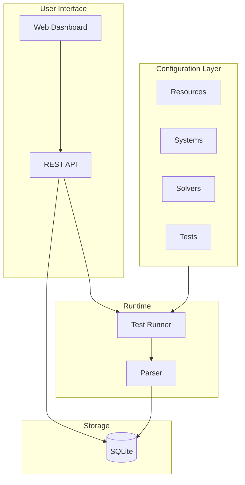
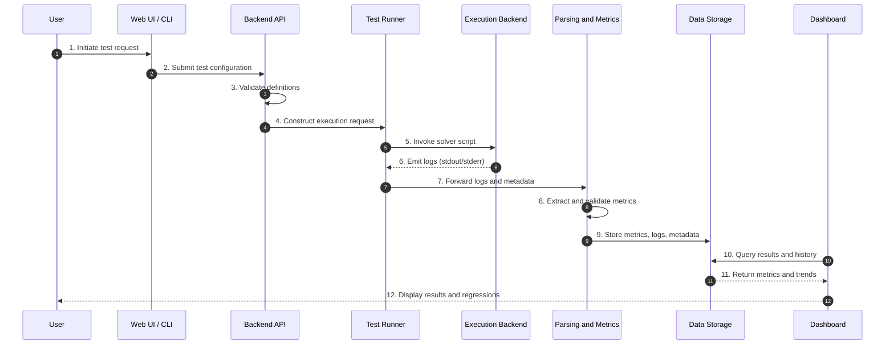

# HPC Regression Testing Platform — Architecture Design

**Dow / Berkeley Capstone Project — Spring 2026**

This document is the authoritative technical reference for the HPC Regression Testing Platform. It defines the system architecture, data schemas, configuration formats, and API specification for team review and implementation.

---

## 1. Introduction

### 1.1 Purpose

This architecture document serves to:

- Provide a shared understanding of the system design across the team
- Define schemas and interfaces for consistent implementation
- Support sponsor and faculty review
- Guide future development and extensions

### 1.2 Audience

- Development team (Tech Lead, QA, DevOps)
- Corporate sponsor (Dow HPC)
- Faculty mentor
- External contributors

### 1.3 Scope

| In Scope | Out of Scope |
|----------|---------------|
| MVP: Resource → System → Solver → Test framework | Production-grade Dow test suite |
| Execution-agnostic Test Runner | Direct SLURM integration |
| Log parsing + metric extraction | Job scheduling / cluster orchestration |
| SQLite storage | Advanced anomaly detection |
| Web UI for scheduling + viewing results | Multi-solver comparison dashboards |
| Sample solvers and tests | CI integration |

### 1.4 References

- [Dow Project Proposal](https://github.berkeley.edu/Chem-283/DOW-1-26/blob/main/docs/Dow_Project_Proposal_v0.01.pdf)
- Scope Document (Dow / Berkeley Capstone)
- Technical Summary (HPC Regression Testing Platform Proposal)
- Architecture Sketch (Work in Progress)
- [README](../README.md) — Quick start and CLI usage

---

## 2. System Overview

### 2.1 High-Level Description

The platform is a modular, execution-agnostic HPC regression testing system. It:

1. Defines resources, systems, solvers, and tests via declarative configuration
2. Executes solver-provided scripts as black-box processes
3. Captures logs and extracts performance metrics
4. Stores results and visualizes performance drift over time

The platform never calls SLURM or any scheduler directly. Solver scripts control execution; they may run locally, submit to SLURM, use MPI, or invoke containers.

### 2.2 Design Principles

- **Execution-Agnostic** — Solver scripts control how tests run; the platform passes environment variables and captures output
- **Modularity** — Resources, systems, solvers, and tests are independently defined and versioned
- **Maintainability** — Lightweight components suitable for small HPC teams
- **Reproducibility** — All behavior defined declaratively; parser configs are tracked
- **Extensibility** — New solvers added by dropping in a folder with a definition and run script
- **Minimal Dependencies** — Simple Python environment; optional containerization

### 2.3 Out of Scope (MVP)

- Production-grade Dow test suite
- Direct SLURM integration or job management
- Advanced anomaly detection
- Multi-solver comparison dashboards
- CI integration

---

## 3. Component Architecture



### 3.1 Configuration Layer

Declarative YAML definitions loaded at runtime. No database storage of definitions in MVP.

- **Resources** — CPU/GPU counts, memory, node characteristics
- **Systems** — Resource bundles, environment variables, constraints
- **Solvers** — Self-contained directories with `solver.yaml`, run script, optional parser config
- **Tests** — Solver/system pairings, parameters, success criteria

### 3.2 Test Runner

- Loads resource/system/solver/test definitions
- Exports environment variables to solver scripts
- Executes solver scripts as black-box processes
- Captures stdout, stderr, exit codes, timing
- Invokes parser for metric extraction

### 3.3 Parser

- Regex-based extraction from raw logs
- YAML-defined `parser_config` per solver
- Validates required metrics and optional ranges
- Returns structured metrics for storage

### 3.4 Storage

- SQLite database for run metadata and metrics
- Stores: test name, solver, system, returncode, passed, runtime, timestamp, stdout, stderr, metrics (JSON)

### 3.5 REST API

- Backend for Web UI and programmatic access
- Endpoints for solvers, tests, run execution, runs, metrics history

### 3.6 Web Dashboard

- Initiate or schedule test runs
- View recent results and logs
- Browse historical runs
- Filter by solver, system, date
- Visualize performance trends (Chart.js)

---

## 4. Data Flow



**Execution Backend** may be local (subprocess), SLURM (if solver script submits), SSH, or containerized. The platform does not assume any specific backend.

---

## 5. Schema Definitions

### 5.1 Resource Schema

Resources define hardware characteristics. Systems are built from one or more resources.

| Field | Type | Required | Description |
|-------|------|----------|-------------|
| name | string | Yes | Unique identifier |
| cpus | int | No | CPU count (1–N) |
| gpus | int | No | GPU count |
| memory_gb | float | No | Memory in GB |
| nodes | int | No | Node count (future) |
| infiniband | bool | No | InfiniBand present (future) |

### 5.2 System Schema

Systems bundle resources and provide environment variables for solver execution.

| Field | Type | Required | Description |
|-------|------|----------|-------------|
| name | string | Yes | Unique identifier |
| resources | string[] | Yes | Resource names |
| env | object | No | Environment variables (key-value) |
| constraints | string[] | No | Additional constraints |

### 5.3 Solver Schema

Each solver is a self-contained directory. Required: `solver.yaml`, run script. Optional: `parser_config.yaml`, `build.sh`, `inputs/`.

| Field | Type | Required | Description |
|-------|------|----------|-------------|
| name | string | Yes | Solver identifier |
| entrypoint | string | Yes | Run script path (relative to solver dir) |
| allowed_systems | string[] | Yes | Compatible system names |
| version | string | No | Default `0.0.0` |
| parser_config | string | No | Path to parser YAML (e.g. `parser_config.yaml`) |
| metrics | MetricSpec[] | No | Expected metrics and validation ranges |
| log_names | string[] | No | Expected log file names |
| cwd | bool | No | Use solver dir as cwd (default true) |

### 5.4 MetricSpec Schema

Defines expected metrics and validation bounds for a solver.

| Field | Type | Description |
|-------|------|-------------|
| name | string | Metric identifier |
| unit | string | e.g. MLUPS, s |
| min | float | Lower bound for validation |
| max | float | Upper bound |
| required | bool | Must be present in extracted metrics |

### 5.5 Test Schema

Tests pair a solver with a system and define success criteria.

| Field | Type | Required | Description |
|-------|------|----------|-------------|
| name | string | Yes | Test identifier |
| solver | string | Yes | Solver name |
| system | string | Yes | System name |
| parameters | object | No | Parameters passed to solver |
| success_criteria | object | No | e.g. `returncode: 0` |
| schedule | string | No | Cron expression or `manual` |

### 5.6 Parser Config Schema

YAML file defining regex patterns for metric extraction from solver logs.

| Field | Type | Description |
|-------|------|-------------|
| patterns | array | List of extraction rules |

Each pattern:

| Field | Type | Description |
|-------|------|-------------|
| name | string | Metric name |
| regex | string | Regex with one capture group |
| type | string | `str`, `float`, or `int` |

### 5.7 RunResult Schema (Runtime)

Produced by the Test Runner after each run; stored in the database.

| Field | Type | Description |
|-------|------|-------------|
| test_name | string | Test identifier |
| solver_name | string | Solver identifier |
| system_name | string | System identifier |
| returncode | int | Process exit code |
| passed | bool | Success per success_criteria |
| stdout | string | Standard output |
| stderr | string | Standard error |
| runtime_seconds | float | Wall-clock time |
| timestamp | string | ISO 8601 |
| metrics | object | Extracted key-value metrics |

### 5.8 Database Schema

**runs** table:

| Column | Type | Description |
|--------|------|-------------|
| id | INTEGER | Primary key, auto-increment |
| test_name | TEXT | Not null |
| solver_name | TEXT | Not null |
| system_name | TEXT | Not null |
| returncode | INTEGER | Not null |
| passed | INTEGER | 0 or 1 |
| runtime_seconds | REAL | Not null |
| timestamp | TEXT | Not null |
| stdout | TEXT | Nullable |
| stderr | TEXT | Nullable |
| metrics_json | TEXT | JSON object, nullable |

**Indexes:** `solver_name`, `timestamp`

---

## 6. Configuration File Formats

### 6.1 Resources

**Path:** `configs/resources/*.yaml`

```yaml
resources:
  - name: dev-local
    cpus: 4
    memory_gb: 8
  - name: hpc-node
    cpus: 64
    gpus: 4
    memory_gb: 256
```

### 6.2 Systems

**Path:** `configs/systems/*.yaml`

```yaml
systems:
  - name: dev-system
    resources: [dev-local]
    env: {}
  - name: hpc-cluster-01
    resources: [hpc-node]
    env:
      MODULEPATH: /opt/modules
```

### 6.3 Tests

**Path:** `configs/tests/*.yaml`

```yaml
tests:
  - name: echo-test
    solver: echo-solver
    system: dev-system
    parameters: {}
    success_criteria:
      returncode: 0
  - name: python-test
    solver: python-solver
    system: dev-system
    parameters: {}
    success_criteria:
      returncode: 0
```

### 6.4 Solver Definition

**Path:** `solvers/<name>/solver.yaml`

```yaml
name: python-solver
version: "1.0.0"
entrypoint: run.py
allowed_systems: [dev-system]
parser_config: parser_config.yaml
metrics:
  - name: mlups
    unit: MLUPS
    min: 0
    required: true
  - name: runtime_seconds
    unit: s
    required: true
log_names: [stdout]
```

### 6.5 Parser Config

**Path:** `solvers/<name>/parser_config.yaml`

```yaml
patterns:
  - name: mlups
    regex: 'MLUPS:\s*([\d.e+-]+)'
    type: float
  - name: runtime_seconds
    regex: 'runtime_seconds:\s*([\d.]+)'
    type: float
  - name: status
    regex: 'status:\s*(\w+)'
    type: str
```

---

## 7. REST API Specification

| Endpoint | Method | Request | Response |
|----------|--------|---------|----------|
| `/api/solvers` | GET | — | `[{name, version, allowed_systems, has_parser}]` |
| `/api/tests` | GET | — | `[{name, solver, system}]` |
| `/api/run_tests` | POST | `{tests?: string[]}` | `RunResult[]` |
| `/api/runs` | GET | `?solver=&limit=&offset=` | `Run[]` |
| `/api/runs/:id` | GET | — | `Run` |
| `/api/metrics/:solver/:metric` | GET | `?limit=` | `[{timestamp, value}]` |

### Request/Response Examples

**POST /api/run_tests**

Request:
```json
{}
```
or
```json
{"tests": ["echo-test", "python-test"]}
```

Response:
```json
[
  {
    "test_name": "echo-test",
    "solver_name": "echo-solver",
    "system_name": "dev-system",
    "returncode": 0,
    "passed": true,
    "runtime_seconds": 0.005,
    "timestamp": "2026-02-14T19:00:00.000000+00:00",
    "metrics": {}
  }
]
```

**GET /api/runs?solver=python-solver&limit=10**

Response: Array of run objects with `id`, `test_name`, `solver_name`, `system_name`, `returncode`, `passed`, `runtime_seconds`, `timestamp`, `metrics`.

**GET /api/metrics/python-solver/mlups?limit=100**

Response:
```json
[
  {"timestamp": "2026-02-14T19:00:00+00:00", "value": 2100000.0},
  {"timestamp": "2026-02-14T18:30:00+00:00", "value": 2050000.0}
]
```

---

## 8. Solver Directory Template

Each solver is a self-contained directory. All paths in config files are relative to the solver directory. See [solver_template.md](solver_template.md) for full specification.

### Canonical Structure

```
solvers/<solver-name>/
├── solver.yaml           # Required: metadata, entrypoint, allowed systems
├── parser_config.yaml    # Optional: regex patterns for metric extraction
├── run.sh                # Required (or run.py): entrypoint script
├── build.sh              # Optional: build/compile step
├── inputs/               # Optional: input files, test cases
│   └── ...
└── ...                   # Any other solver-specific files
```

### Required Files

- **solver.yaml** — Must define `name`, `entrypoint`, `allowed_systems`
- **Run script** — Must exist at `entrypoint` path; executed as black-box

### Optional Files

- **parser_config.yaml** — For metric extraction from logs
- **build.sh** — Pre-run build step (not invoked by platform in MVP)
- **inputs/** — Solver-specific input data

### Conventions

- Solver directory name should match `name` in `solver.yaml`
- Paths in `solver.yaml` (e.g. `parser_config`, `entrypoint`) are relative to the solver directory
- Run script receives environment variables from the System; platform sets `cwd` to solver directory

---

## 9. Design Decisions

### 9.1 Execution-Agnostic

Solver scripts control execution. The platform never calls SLURM, MPI, or any scheduler. Scripts may internally submit jobs, spawn processes, or use containers. This maximizes portability across heterogeneous HPC environments.

### 9.2 Config vs. Database

Definitions (resources, systems, solvers, tests) are loaded from YAML files at runtime. Only run results are stored in the database. This keeps the system simple and allows config to live in version control.

### 9.3 SQLite for MVP

SQLite is simple, portable, and requires no setup. DuckDB was considered for analytical workloads and time-series queries; it remains an option for future enhancement.

### 9.4 Regex-Based Parsing

Regex patterns in YAML provide flexibility for diverse solver log formats. Each solver can define its own `parser_config`. More structured parsers (e.g. JSON output) can be added later.

### 9.5 Self-Contained Solver Directories

Each solver owns its config, parser, and scripts. Adding a solver means dropping a folder; no central registry update required.

---

## 10. Testing

Unit tests cover the major features. Run with `make test` or `uv run pytest src/core/tests`.

| Test Module | Coverage |
|-------------|----------|
| `test_config.py` | `load_resources`, `load_systems`, `load_solvers`, `load_tests`, `load_all`; verifies `_template` is skipped |
| `test_parser.py` | `extract_metrics` (dict and file), `validate_metrics` (required, ranges) |
| `test_storage.py` | `init_db`, `store_run`, `get_runs`, `get_run_by_id`, `get_metrics_history` |
| `test_runner.py` | End-to-end run with minimal solver; run with metric extraction from `parser_config` |

Tests use `tmp_path` for isolation. No external services required.

---

## 11. Future Considerations

- **Scheduled test execution** — Cron-like or internal scheduler
- **DuckDB** — Columnar storage for analytical queries and trend analysis
- **Authentication** — API key or session-based auth for Web UI endpoints
- **Object storage** — Raw logs in S3/MinIO; DB stores metadata references
- **Test Registry** — DB-backed storage of solver/test definitions for multi-user workflows
- **Dry-run mode** — Parser validates config without executing
- **Baseline establishment** — Automated repeated runs for statistical baselines
