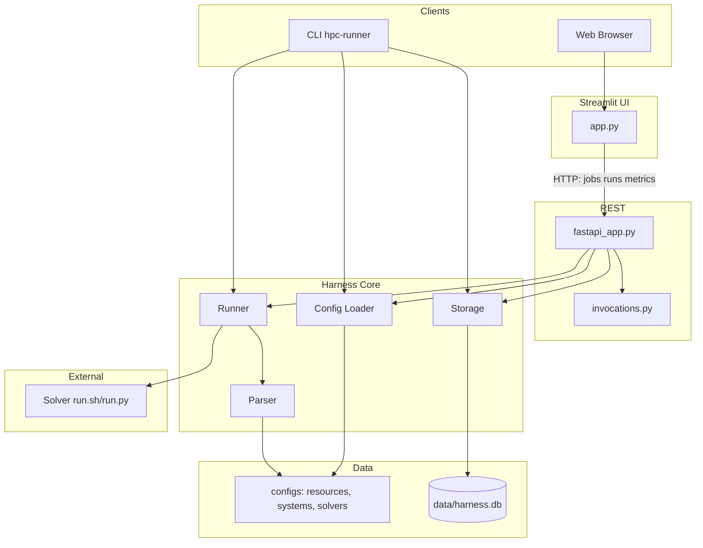
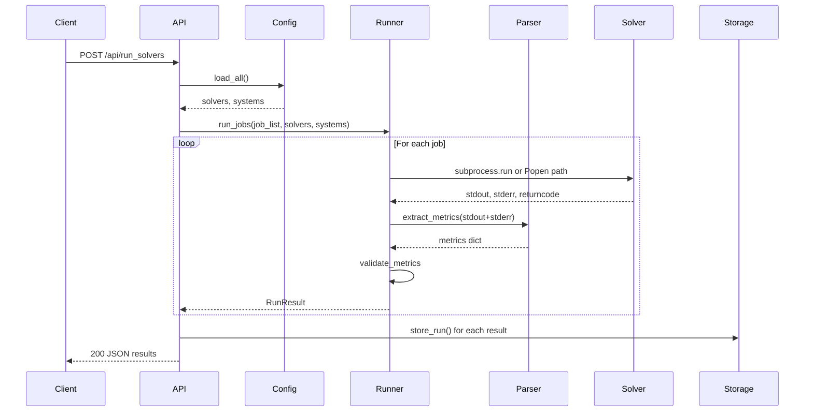
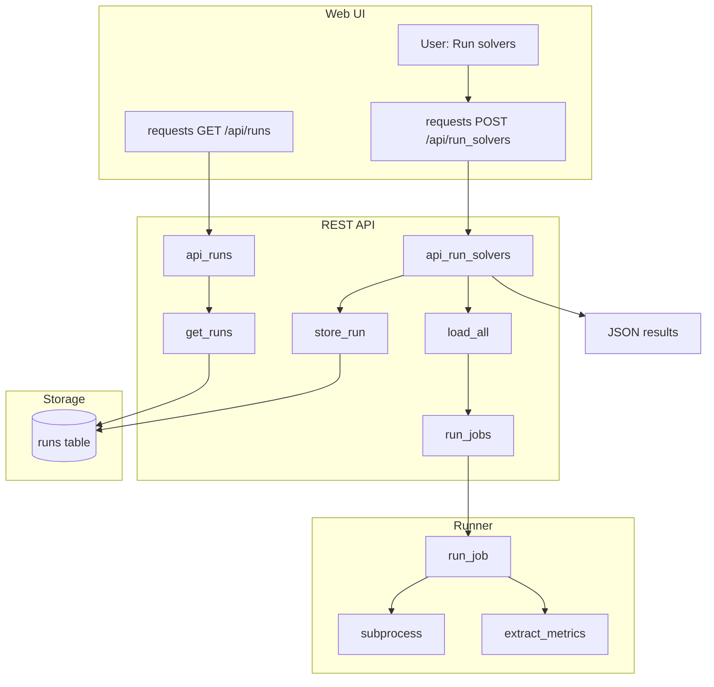

# System Architecture

Style guide, repository directory map, and sponsor-facing overview: [README.md](../README.md).

## 1. High-Level Overview

- **Purpose**: Execution-agnostic harness for HPC regression testing (solver runs with stored metrics and baselines).
- **Config model (solver-first)**: On disk, only **`configs/resources/`**, **`configs/systems/`**, and **`configs/solvers/`**. There is **no** `configs/jobs/` tree—runnables are expanded from each solver’s `allowed_systems` and `default_system`; the harness uses **`{solver}@{system}`** as the run identity in storage and APIs.
- **Entry points**: CLI (`hpc-runner`), REST API (FastAPI), Streamlit UI
- **Key principle**: Solver scripts are black-box **subprocesses**. The harness does **not** embed SLURM/MPI APIs; solver entrypoints may call schedulers, `docker exec`, etc. (e.g. [`configs/solvers/lammps-slurm/run.sh`](../configs/solvers/lammps-slurm/run.sh)).
- **Data flow (end-to-end)**: CLI → Runner → Parser → Storage → API → UI (Streamlit uses the REST API over HTTP).

## 2. Component Architecture

Primary browser path: **Streamlit talks HTTP to FastAPI** for runs, history, and metrics. Some UI helpers also read the DB or call helpers that use shared harness code.



## 3. Data Models

| Model | Location | Purpose |
|-------|----------|---------|
| Resource | `src/core/src/harness/config/schemas.py` | CPU/GPU, memory, node definitions |
| System | `src/core/src/harness/config/schemas.py` | Resource bundle, env vars, constraints |
| Solver | `src/core/src/harness/config/schemas.py` | Entrypoint, parser_config, allowed_systems |
| Job | `src/core/src/harness/config/schemas.py` | Runtime pairing (solver+system); expanded from solver-first config—not a separate `configs/jobs/` file |
| RunResult | `src/core/src/harness/runner.py` | job_name, returncode, metrics, passed, processor, validation_errors, batch fields, optional `scheduler_backend`, `scheduler_job_ids`, `submit_container` (from SLURM smoke scripts) |
| InvocationControl | `src/core/src/harness/runner.py` | Background runs: cancel event, subprocess handle, streamed SLURM job ids |

## 4. Config Structure

The platform is **solver-first**: `load_all()` loads **resources**, **systems**, and **solvers** only. For each solver, the runner builds concrete run targets from **`allowed_systems`** and **`default_system`**, producing identities **`{solver}@{system}`**. There is **no** user-maintained `configs/jobs/` directory in this repository.

The loader still exposes `load_jobs()` for a legacy `configs/jobs/` layout if such a directory exists elsewhere; **default paths and this repo use solver-first YAML only.**

```
configs/
├── resources/     # Resource definitions (cpus, gpus, memory)
├── systems/       # System definitions (resources, env)
└── solvers/       # Solver packages
    └── <solver-name>/
        ├── solver.yaml       # Metadata, entrypoint, allowed_systems, default_system, parser_config path
        ├── run.sh or run.py  # Executed as black-box
        └── parser_config.yaml  # Optional: regex patterns for metrics
```

## 5. Job Execution Flow

### 5.0 Synchronous `POST /api/run_solvers` (default)



### 5.0b Background `POST /api/run_solvers` with `"background": true`

The API builds a runtime job list via `build_jobs_from_solver_specs` from solver YAML + request body. With **`background: true`**, it starts **one worker thread per solver**, each with its own `invocation_id`. The **202** body includes `invocations` (list of `{ solver_name, invocation_id, run_labels }`).

Each worker runs `run_jobs(..., invoke_ctl=...)` for its single job, stores rows, then updates the in-memory registry.

- **Poll**: `GET /api/invocations/{id}` returns `status`, `run_labels`, `execution` (local pid vs SLURM ids), `scheduler_job_ids`, `submit_container`, `jobs_total`, `jobs_completed`, and `results` when finished.
- **Unified monitor**: `GET /api/invocations/{id}/execution_status` — adds `scheduler_detail` when SLURM ids exist.
- **List**: `GET /api/invocations` — optional query `active_only=true` for `queued` / `running` rows only.
- **Live SLURM**: `GET /api/invocations/{id}/slurm_status`.
- **Cancel**: `POST /api/invocations/{id}/cancel` — sets a cooperative cancel flag, best-effort `scancel` for known job ids, and `terminate()` on the local subprocess. `scancel` runs when **`HARNESS_ALLOW_SCANCEL=1`**, **`RUN_SLURM_E2E=1`**, or **`DOCKER_SLURM_CONTAINER`** / **`DOCKER_SLURM_SUBMIT_CONTAINER`** is set (so production Docker SLURM setups do not require the E2E flag).

`run_jobs` skips any **remaining** jobs after cancel with `validation_errors: ["Cancelled by user"]` when a multi-job invocation is used.

Registry is **per-process**; not durable across API restarts or multiple workers.

### 5.1 Call Graph (synchronous path)



**Code path summary:**

| Step | Message / data | Code path |
|------|----------------|-----------|
| 1–2 | User runs solvers → API | `requests.post('/api/run_solvers')` → `fastapi_app.api_run_solvers()` |
| 3 | Load definitions | `_load_definitions()` → `load_all(CONFIG_DIR, None)` |
| 4 | Execute jobs | `run_jobs(...)` → `run_job()` |
| 5–6 | Solver stdout/stderr | `subprocess.run` or Popen+reader when `invoke_ctl` set |
| 7–8 | Logs → metrics | `extract_metrics`, `validate_metrics` |
| 9 | Persist | `store_run(DB_PATH, r)` |
| 10–12 | Dashboard reads | `GET /api/runs` → `get_runs()` |

**Key files:** [`src/api/src/basic_restapi/fastapi_app.py`](../src/api/src/basic_restapi/fastapi_app.py), [`invocations.py`](../src/api/src/basic_restapi/invocations.py), [`src/core/src/harness/runner.py`](../src/core/src/harness/runner.py), [`parser`](../src/core/src/harness/parser/parser.py), [`db.py`](../src/core/src/harness/storage/db.py).

## 6. API Endpoints

| Endpoint | Method | Description |
|----------|--------|-------------|
| `/` | GET | Redirects to `/docs` (Swagger UI) |
| `/api/health` | GET | Health check |
| `/api/solvers` | GET | List solvers |
| `/api/systems` | GET | List systems |
| `/api/run_solvers` | POST | Run solvers (`solvers`, `batch_name`, `background`) — one invocation per solver when background — 202 |
| `/api/runs` | GET | List runs (?solver=, ?processor=, ?limit=, ?offset=) |
| `/api/runs` | DELETE | Body `{ "ids": [1,2,3] }` — delete stored runs |
| `/api/runs/<id>` | GET | Run detail |
| `/api/runs/<id>/slurm_status` | GET | Live `squeue`/`sacct` when `RUN_SLURM_E2E=1` |
| `/api/runs/<id>/set_baseline` | POST | Set baseline for solver |
| `/api/invocations` | GET | List invocations (`?active_only=true`) |
| `/api/invocations/<id>` | GET | Background run status, live SLURM fields, progress, results, `execution` block (local pid / scheduler ids) |
| `/api/invocations/<id>/execution_status` | GET | Unified monitor payload + `scheduler_detail` when SLURM ids exist |
| `/api/invocations/<id>/slurm_status` | GET | Live `squeue`/`sacct` for ids seen on this invocation (`RUN_SLURM_E2E=1`) |
| `/api/invocations/<id>/cancel` | POST | Cancel background run |
| `/api/solver_summaries` | GET | Per-solver aggregates from `runs` |
| `/api/baseline_comparison` | GET | Baseline vs other runs |
| `/api/metrics/<solver>/<metric>` | GET | Metric history |
| `/api/available_metrics` | GET | Solver/metric pairs |
| `/api/get_job_batch_uuids` | GET | Batch UUIDs (ordered by latest activity per batch) |

## 7. Dashboard Views

The **Streamlit UI** (`make ui`, port 8501):

- **Home**: Welcome text; **solver monitoring** table (`GET /api/solver_summaries`)
- **Individual Trends**: Solver/metric line charts
- **Run Solvers**: **Active runs** (one invocation per solver when background); select solvers; optional raw invocation-id inspect; Monitor / Stop
- **Run History**: Batches; expand stdout/stderr/metrics; **delete selected runs**; optional **Refresh SLURM status** when run has scheduler metadata
- **Long-Term Trends**: Filtered charts
- **Configs**: Read-only YAML view (category/file)

The UI uses **`HPC_API_URL`** (via [`api_config.py`](../src/ui/api_config.py)) to reach the API.

## 8. Storage Schema

Table **`runs`**: id, job_name, solver_name, system_name, returncode, passed, runtime_seconds, timestamp, stdout, stderr, metrics_json, processor, validation_errors, is_baseline, job_batch_uuid, job_batch_date, job_batch_name, scheduler_backend, scheduler_job_ids (JSON), submit_container.

## 9. Deployment

- **Local**: `make api`, `make ui`, `make runner`
- **Stop/restart**: `make stop-services`, `make restart-services`; SLURM env: `make start-services-slurm`
- **External Slurm stack**: `make slurm-up` / `make slurm-down` (see Makefile `SLURM_COMPOSE_DIR`)
- **Docker**: `make docker-build`, `make docker-run`; `make docker-up`

## 10. Workspace Layout

```
e2e_testing/
├── configs/           # resources/, systems/, solvers/ (YAML; solver-first)
├── data/              # harness.db (gitignored)
├── docker/            # compose, lammps/, slurm_sleep/, overlays (see docker/README.md)
├── docs/              # architecture, user guide, E2E/SLURM guides
├── scripts/           # Makefile helpers (services, docker validation)
├── src/
│   ├── core/          # harness package (src/harness/, tests/)
│   ├── api/           # basic_restapi (src/basic_restapi/, tests/)
│   └── ui/            # Streamlit app, tests/e2e/ (Playwright)
├── .github/workflows/ # CI
├── pyproject.toml     # uv workspace
├── Makefile
└── CHANGELOG.md
```
