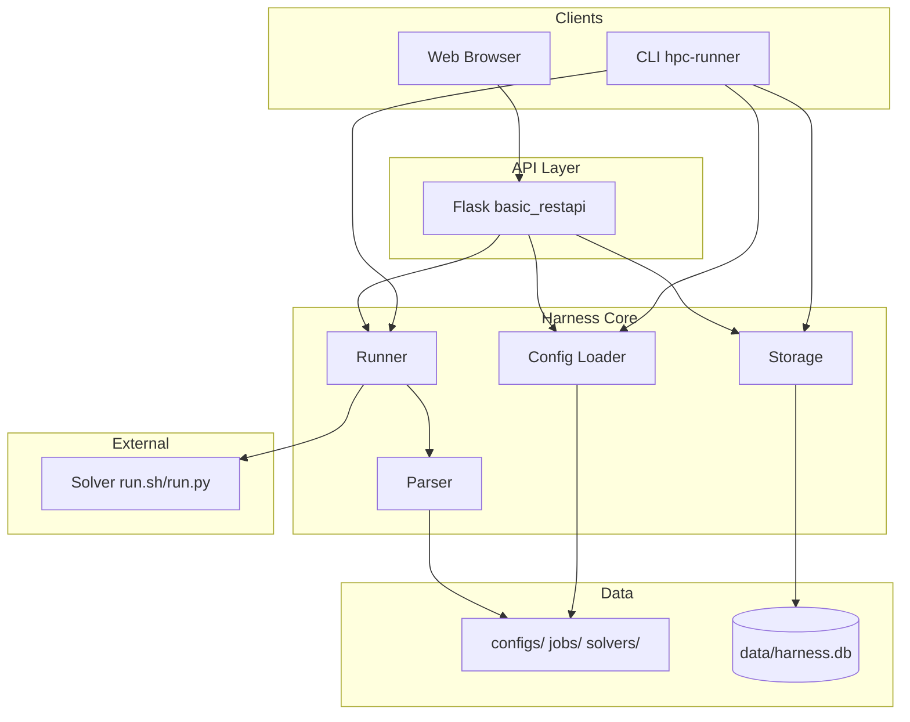
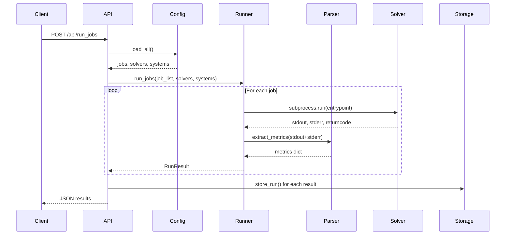

# System Architecture

## 1. High-Level Overview

- **Purpose**: Execution-agnostic harness for running solver jobs (HPC regression testing)
- **Entry points**: CLI (`hpc-runner`), Web API + Dashboard
- **Key principle**: Solver scripts are black-box; platform never calls schedulers (SLURM, MPI, etc.)

## 2. Component Architecture



## 3. Data Models

| Model | Location | Purpose |
|-------|----------|---------|
| Resource | `src/core/src/harness/config/schemas.py` | CPU/GPU, memory, node definitions |
| System | `src/core/src/harness/config/schemas.py` | Resource bundle, env vars, constraints |
| Solver | `src/core/src/harness/config/schemas.py` | Entrypoint, parser_config, allowed_systems |
| Job | `src/core/src/harness/config/schemas.py` | Solver+system pairing, success_criteria |
| RunResult | `src/core/src/harness/runner.py` | job_name, returncode, metrics, passed, processor |

## 4. Config Structure

```
configs/
├── resources/     # Resource definitions (cpus, gpus, memory)
├── systems/       # System definitions (resources, env)
├── jobs/          # Job definitions (solver+system pairings)

solvers/
├── <solver-name>/
│   ├── solver.yaml       # Metadata, entrypoint, parser_config path
│   ├── run.sh or run.py  # Executed as black-box
│   └── parser_config.yaml  # Optional: regex patterns for metrics
```

## 5. Job Execution Flow



## 6. API Endpoints

| Endpoint | Method | Description |
|----------|--------|-------------|
| `/` | GET | Dashboard (index.html) |
| `/api/solvers` | GET | List solvers |
| `/api/jobs` | GET | List jobs |
| `/api/run_jobs` | POST | Run jobs (body: `{"jobs": ["name1"]}`) |
| `/api/runs` | GET | List runs (?solver=, ?processor=, ?limit=) |
| `/api/runs/<id>` | GET | Run detail |
| `/api/metrics/<solver>/<metric>` | GET | Metric history for trends |

## 7. Dashboard Views

- **Test Runs**: Table of runs, "Run All Jobs" button
- **Solvers**: Grid of configured solvers
- **Performance Trends**: Chart.js line chart (solver + metric selector)

## 8. Storage Schema

Table `runs`: id, job_name, solver_name, system_name, returncode, passed, runtime_seconds, timestamp, stdout, stderr, metrics_json, processor (probed at runtime via `platform.machine()`)

## 9. Deployment

- **Local**: `make api`, `make runner`
- **Docker**: `make docker-build`, `make docker-run` (mounts `./data`)
- **docker-compose**: `docker compose up --build`

## 10. Workspace Layout

```
DOW-1-26/
├── configs/           # YAML configs
├── solvers/           # Solver packages
├── data/              # harness.db (gitignored)
├── src/
│   ├── core/          # harness package
│   └── api/           # basic_restapi package
├── pyproject.toml     # uv workspace
└── Makefile
```
