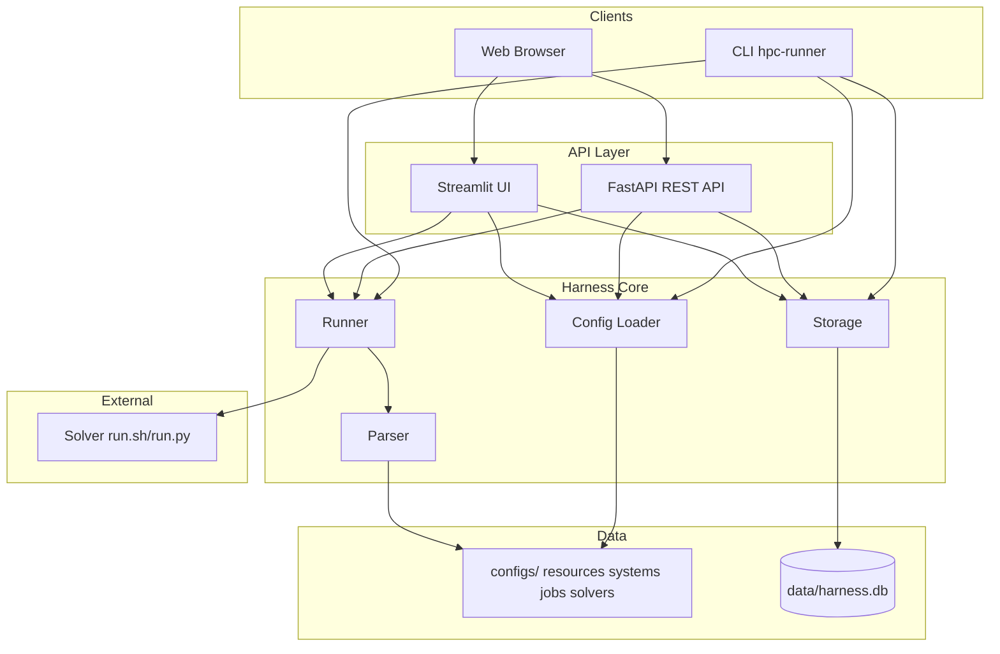
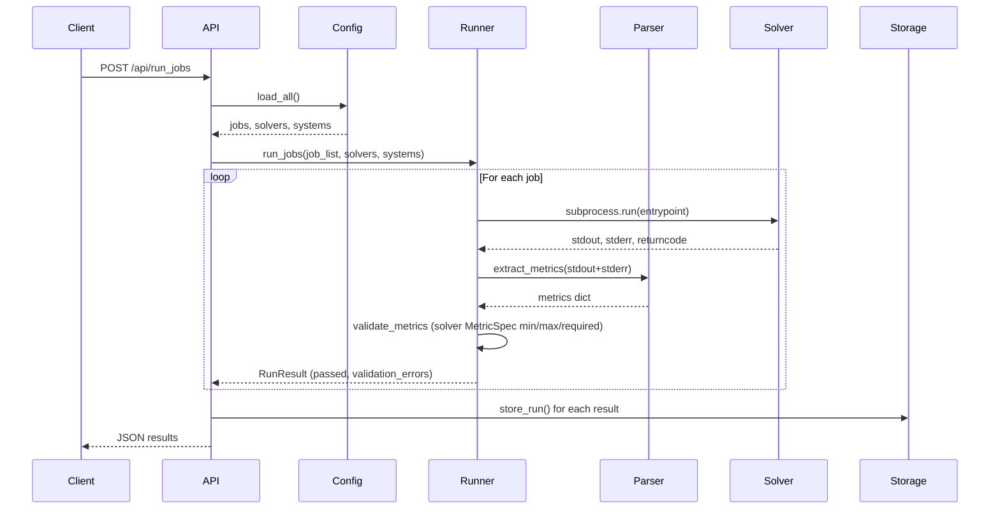
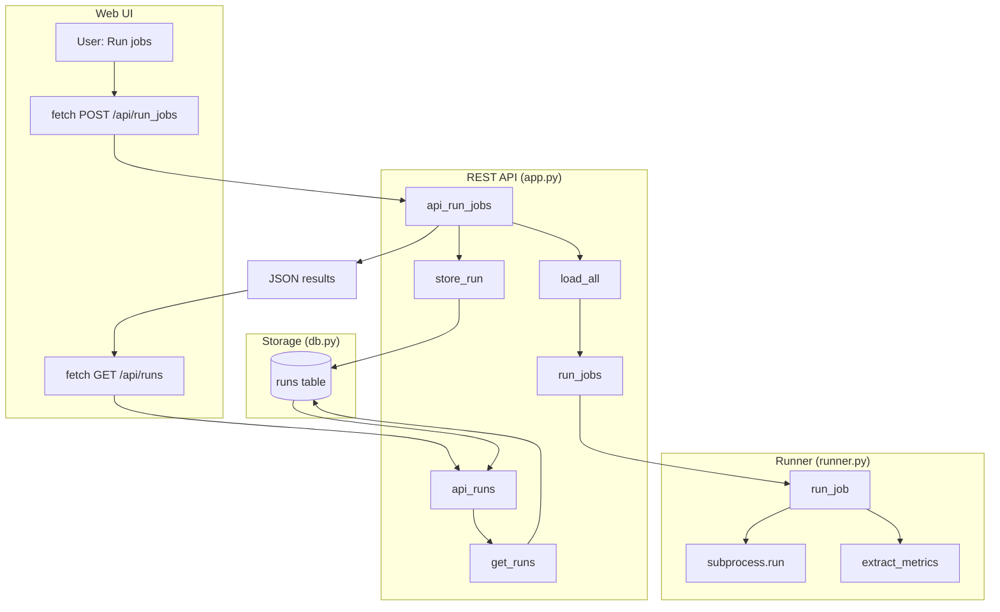

# System Architecture

## 1. High-Level Overview

- **Purpose**: Execution-agnostic harness for running solver jobs (HPC regression testing)
- **Entry points**: CLI (`hpc-runner`), REST API (FastAPI), Streamlit UI
- **Key principle**: Solver scripts are black-box; platform never calls schedulers (SLURM, MPI, etc.)

## 2. Component Architecture



## 3. Data Models

| Model | Location | Purpose |
|-------|----------|---------|
| Resource | `src/core/src/harness/config/schemas.py` | CPU/GPU, memory, node definitions |
| System | `src/core/src/harness/config/schemas.py` | Resource bundle, env vars, constraints |
| Solver | `src/core/src/harness/config/schemas.py` | Entrypoint, parser_config, allowed_systems |
| Job | `src/core/src/harness/config/schemas.py` | Solver+system pairing, success_criteria |
| RunResult | `src/core/src/harness/runner.py` | job_name, returncode, metrics, passed, processor, validation_errors |

## 4. Config Structure

```
configs/
├── resources/     # Resource definitions (cpus, gpus, memory)
├── systems/       # System definitions (resources, env)
├── jobs/          # Job definitions (solver+system pairings)
└── solvers/       # Solver packages (lives inside configs)
    └── <solver-name>/
        ├── solver.yaml       # Metadata, entrypoint, parser_config path
        ├── run.sh or run.py  # Executed as black-box
        └── parser_config.yaml  # Optional: regex patterns for metrics
```

## 5. Job Execution Flow



### 5.1 Call Graph (Message Flow)

How messages move through the system when a job run is requested:



**Code path summary:**

| Step | Message / data | Code path |
|------|----------------|-----------|
| 1–2 | User runs jobs → API | `fetch('POST', '/api/run_jobs')` → `app.api_run_jobs()` |
| 3 | Load definitions | `_load_definitions()` → `load_all(CONFIG_DIR, SOLVERS_DIR)` |
| 4 | Execute jobs | `run_jobs(job_list, solvers, systems)` → for each job: `run_job()` |
| 5–6 | Solver stdout/stderr | `subprocess.run(cmd)` in `run_job()`; stdout/stderr captured |
| 7–8 | Logs → metrics | `raw_logs = stdout + stderr` → `extract_metrics(raw_logs, solver.parser_config)` |
| 8a | Metric validation | `validate_metrics(metrics, required, ranges)` from solver `metrics` spec; if invalid, `passed = False` and `validation_errors` list is set |
| 9 | Persist | `store_run(DB_PATH, r)` writes RunResult (stdout, stderr, metrics_json, validation_errors) to DB |
| 10–12 | Dashboard reads | `fetch('/api/runs')` → `api_runs()` → `get_runs()` → JSON to UI |

**Key files:** `src/api/src/basic_restapi/app.py` (API), `src/core/src/harness/runner.py` (run_job, run_jobs), `src/core/src/harness/parser/parser.py` (extract_metrics), `src/core/src/harness/storage/db.py` (store_run, get_runs).

## 6. API Endpoints

| Endpoint | Method | Description |
|----------|--------|-------------|
| `/` | GET | Redirects to `/docs` (Swagger UI) |
| `/api/solvers` | GET | List solvers |
| `/api/jobs` | GET | List jobs |
| `/api/run_jobs` | POST | Run jobs (body: `{"jobs": ["name1"]}`) |
| `/api/runs` | GET | List runs (?solver=, ?processor=, ?limit=, ?offset=) |
| `/api/runs/<id>` | GET | Run detail |
| `/api/metrics/<solver>/<metric>` | GET | Metric history for trends |

## 7. Dashboard Views

The **Streamlit UI** (`make ui`, port 8501) provides:

- **Home**: Metrics for each solver over the entire job history — select solver and metric, line chart
- **Run Jobs**: Execute HPC jobs — select jobs, "Run All" / "Run Selected" buttons
- **Run History**: Table of runs; filter by solver or processor; expand for stdout, stderr, metrics; failed runs show validation icon (⚠️) and validation_errors when metric validation failed
- **Tests**: Run unit tests (pytest) for the harness
- **Configs**: Edit YAML config files (resources, systems, jobs, solvers)

The **REST API** (`make api`, port 8000) serves JSON; `/docs` provides interactive Swagger UI.

## 8. Storage Schema

Table `runs`: id, job_name, solver_name, system_name, returncode, passed, runtime_seconds, timestamp, stdout, stderr, metrics_json, processor, validation_errors (JSON array of validation error messages; populated when solver defines `metrics` with min/max/required and validation fails).

## 9. Deployment

- **Local**: `make api` (REST API), `make ui` (Streamlit dashboard), `make runner` (CLI)
- **Docker**: `make docker-build`, `make docker-run` (mounts `./data`)
- **docker-compose**: `make docker-up` or `docker compose -f docker/docker-compose.yml up --build` (REST API on port 8000)

## 10. Workspace Layout

```
DOW-1-26/
├── configs/           # YAML configs (resources, systems, jobs, solvers)
├── data/              # harness.db (gitignored)
├── docker/            # Dockerfiles and compose configs
├── src/
│   ├── core/          # harness package
│   ├── api/           # basic_restapi package (FastAPI)
│   └── ui/            # Streamlit dashboard
├── pyproject.toml     # uv workspace
└── Makefile
```
